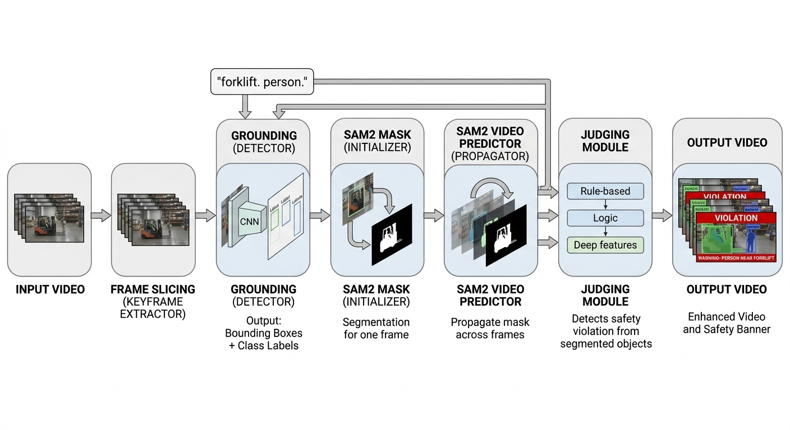
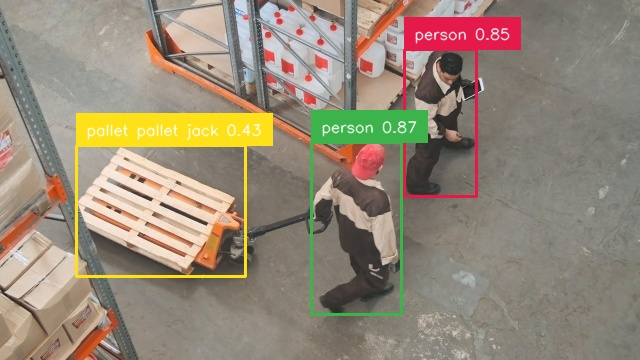
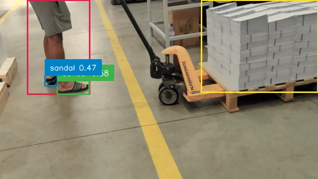

# Warehouse Activity Tracker with Grounded SAM2

A simple warehouse activity tracking and monitoring prototype built with **Grounded SAM2**, combining **Grounding DINO** and **SAM2** to improve **safety** and **productivity** in warehouse scenes.

**Grounding DINO** is an open-vocabulary detector that turns text prompts into object detections. Ref: https://github.com/IDEA-Research/GroundingDINO

**SAM2** uses those detections to generate masks and propagate them across video frames for tracking. Ref: https://github.com/facebookresearch/sam2

---

## Demo

<video src="assets/warehouse-project-demo.mp4" controls width="100%"></video>

If the video does not render in your GitHub view, open it directly here:  
[Watch the demo video](assets/warehouse-project-demo.mp4)

---

## Pipeline

---

## Overview

This project explores how vision foundation models can be used to build a lightweight **warehouse activity tracker**.  
The idea is simple:

- use **text prompts** to detect relevant objects such as workers, pallets, or forklifts
- use **SAM2** to turn those detections into masks and track them over time
- apply a small **judging module** to flag potentially unsafe behavior or rule violations
- render the final result as an annotated monitoring video

The goal is not to build a full production system yet, but to show a practical prototype for **warehouse safety monitoring and operational awareness**.

---

## What this project does

- Detects warehouse objects from natural language prompts
- Generates segmentation masks from detection boxes
- Tracks segmented objects across video frames
- Adds a simple rule-based judging module for violation monitoring
- Produces an annotated output video with labels, masks, and warning banners

---

## Example detections

| Person / pallet detection                            | Unsafe footwear example                              |
| ---------------------------------------------------- | ---------------------------------------------------- |
|  |  |

These examples show how text-guided detection can be used as the first step for downstream segmentation, tracking, and safety checking.

---

## How it works

1. **Input video** is sliced into frames
2. **Grounding DINO** detects target objects from a text prompt such as `"forklift. person."`
3. **SAM2** uses the detected bounding boxes to generate a mask on a selected frame
4. **SAM2 video predictor** propagates the mask through the rest of the video
5. A **judging module** checks for simple safety violations
6. The final system renders an **output video** with:
   - bounding boxes
   - class labels
   - segmentation overlays
   - violation banner when triggered

---

## Tech stack

- Python
- Jupyter Notebook
- Grounding DINO
- SAM2
- OpenCV
- NumPy / PyTorch

---

## Why this matters

Warehouse monitoring often requires both **awareness of moving objects** and **understanding of risky situations**.  
This prototype shows how modern vision models can support:

- safer warehouse operations
- faster review of activity footage
- simple rule-based monitoring for common violations
- a foundation for smarter industrial vision applications

---

## Current scope

This project is currently a **prototype / portfolio experiment** focused on:

- text-guided detection
- segmentation-based tracking
- simple safety violation checking
- visual monitoring output

It is designed as a proof of concept rather than a complete industrial deployment.

---

## Potential next steps

- stronger judging logic for more warehouse rules
- better prompt engineering for harder objects
- multi-object activity analysis
- event logging and statistics dashboard
- real-time inference pipeline

---

## Repository note

The current implementation is mainly **notebook-based**, which makes it easy to experiment with prompts, detections, segmentation results, and tracking behavior.  
This repository is structured to present the workflow and outputs clearly for portfolio and research demonstration purposes.
